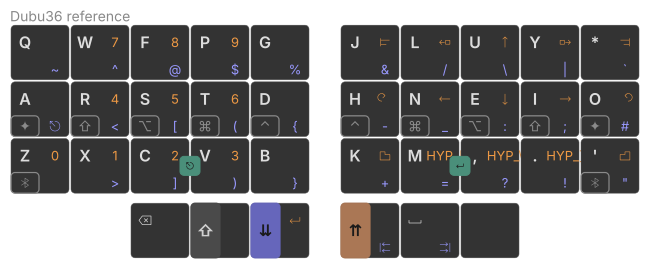
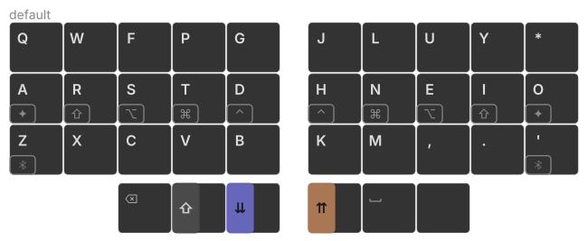
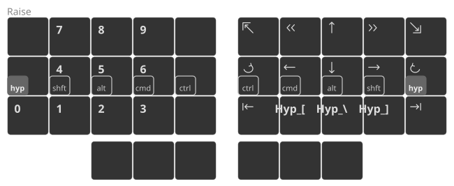
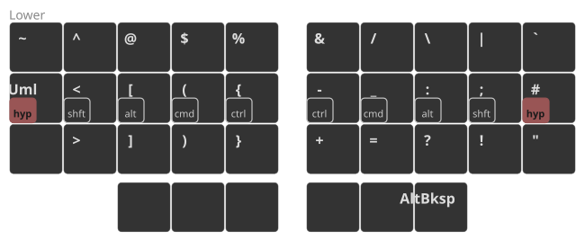
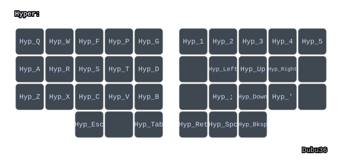
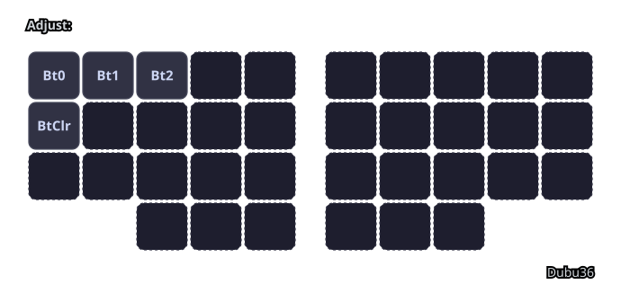
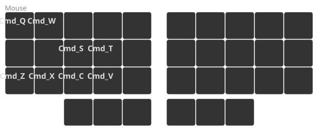
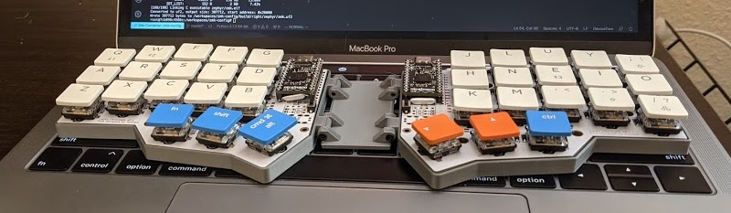
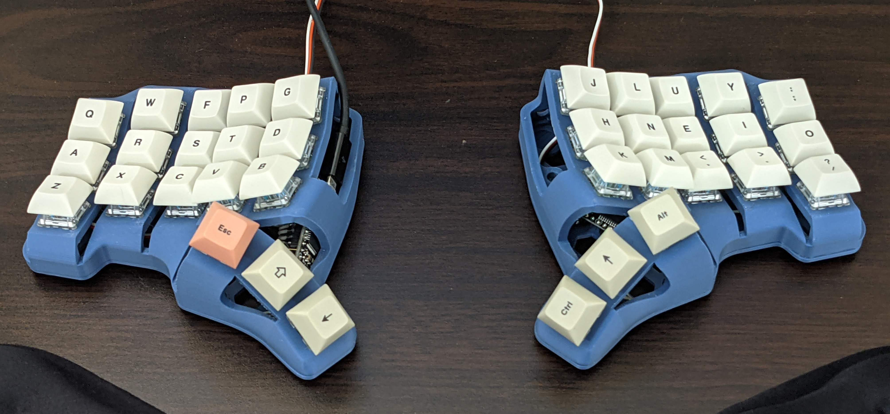

# Dubu36 Keyboard Layout

This repository contains my work-in-progress keyboard layout for 36-key keyboards.

The keymap is specified in firmware-independent [keymap-drawer YAML](https://github.com/caksoylar/keymap-drawer/blob/main/KEYMAP_SPEC.md)
([`keymap.yaml`](keymap.yaml)). That file is the source of truth for:

- ZMK and QMK firmware (`python3 generate_keymap.py zmk|qmk`)
- SVG diagrams (`python3 render_keymap.py`) — per-layer boards plus a stacked reference card

```bash
pip install -r requirements.txt
make keymaps    # regenerate ZMK keymaps from keymap.yaml
make diagrams   # regenerate diagrams/*.svg
```

## Layout diagrams

Stacked reference (Default center, Hyper top-left, Lower/symbols top-right, Raise/nav+num bottom-right):



| Layer | Diagram |
| ----- | ------- |
| Default |  |
| Raise (nav + numbers) |  |
| Lower (symbols) |  |
| Hyper |  |
| Adjust (Bluetooth) |  |
| Mouse (left-hand shortcuts) |  |

## Design notes

The default layer is Colemak, with symbols remapped toward day-to-day writing.

Modifiers used primarily in shortcuts live on the home row. Modifiers and layer
shifts used primarily in fluent writing stay on thumb keys to reduce hold-tap
timing issues.

## Keymap format

[`keymap.yaml`](keymap.yaml) follows the keymap-drawer schema:

- `layout.ortho_layout` — 3×5 split + 3 thumbs per side
- `layers` — ordered mapping; order defines firmware layer indices
- keys are either a string (`"Q"`) or `{t: Tab, h: Lower}` for tap/hold
- `combos` — reserved for future combo definitions

Firmware-specific codes are **not** stored in the YAML. [`generate_keymap.py`](generate_keymap.py)
maps labels such as `WordL`, `Hyp_Q`, `Bt0`, and layer holds (`Raise`, `Lower`, …) to ZMK/QMK.

To edit the layout: change `keymap.yaml`, then run `make keymaps diagrams`.

## Keyboards

I use this layout on these keyboards.

### dubu36-travel

A wireless Corne build with a custom designed case that folds up and sits on top of a standard 19mm
pitch laptop keyboard (e.g. a MacBook). It can easily be used on the go and does not slide around.



Specs:

- 3x5 [Corne Keyboard](https://github.com/foostan/crkbd) PCB
- [nice!nano](https://nicekeyboards.com/nice-nano/) MCU
- [Kailh Choc](https://mkultra.click/choc-switches) Brown switches
- [NuType F1](https://nuphy.com/collections/shop/products/nutype-f1-aw20-late-summer-night-ver-keycaps)
  Keycaps
- Custom printed [travel case](dubu36-travel/case)

### dubu36-ergo

A more ergonomic dactyl style version for the desk. Due to chip shortages, it is currently wired and
running QMK instead of wireless ZMK, until I can get my hands on more nice!nano MCUs.



Specs:

- Bastardkb's [Skeletyl](https://github.com/Bastardkb/Skeletyl) frame
- Some cheap Pro Micro MCU I had lying around
- Printed in
  [SpiderMaker Matte PLA](https://www.amazon.com/SPIDER-MAKER-Matte-Printer-Filament/dp/B07HWNK53C?th=1)
  (Iron Blue)
- Wired using Bastardkb's [flexible PCB](https://bastardkb.com/product/flexible-pcb/)
- Zeal [Zilent V2](https://zealpc.net/products/zilent?variant=5894832324646) switches
- [YMDK DSA Profile 9009](https://kbdfans.com/products/dsa-9009-keycaps-set) Keycaps
