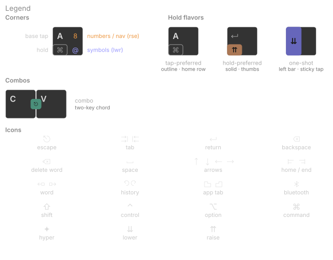

# Dubu36 Keyboard Layout

A 36-key layout. [`keymap.txt`](keymap.txt) is the source; [`keymap_generator`](keymap_generator/)
renders it to ZMK, QMK and the diagrams below. Syntax lives in the `keymap.txt` header.

## Layout diagrams

### default

### rse (nav + numbers)

### lwr (symbols)

### mou (left-hand shortcuts)

## Keyboards

### dubu36-travel

A wireless corne with a folding case that sits on a 19 mm laptop keyboard.

- 3x5 [Corne Keyboard](https://github.com/foostan/crkbd) PCB
- [nice!nano](https://nicekeyboards.com/nice-nano/) MCU
- [Kailh Choc](https://mkultra.click/choc-switches) Brown switches
- [NuType F1](https://nuphy.com/collections/shop/products/nutype-f1-aw20-late-summer-night-ver-keycaps)
  Keycaps
- Custom printed [travel case](dubu36-travel/case)
- [Prospector](https://github.com/carrefinho/prospector) dongle (Seeed XIAO BLE + 1.69" ST7789V LCD)

Standalone firmware is `build/dubu36t_{left,right}.uf2`. Dongle use is
`build/dubu36t_left_peripheral.uf2` plus one `build/dubu36t_dongle_*.uf2`. Switching between them
needs a `settings_reset` flash on every device first
(`make build/settings_reset_nice_nano.uf2` and `make build/settings_reset_xiao_ble.uf2`), then pair
the left half before the right so the dongle's battery widget orders them correctly.

The dongle shows the active layer, both halves' batteries, held modifiers and the BLE output. The
Prospector module draws that four ways and the choice is compiled in, so there is one firmware per
screen: `classic`, `radii`, `field`, `operator`.

### dubu36-ergo

A dactyl for the desk. Wired QMK for now, until more nice!nanos show up.

- Bastardkb's [Skeletyl](https://github.com/Bastardkb/Skeletyl) frame
- Some cheap Pro Micro MCU I had lying around
- Printed in
  [SpiderMaker Matte PLA](https://www.amazon.com/SPIDER-MAKER-Matte-Printer-Filament/dp/B07HWNK53C?th=1)
  (Iron Blue)
- Wired using Bastardkb's [flexible PCB](https://bastardkb.com/product/flexible-pcb/)
- Zeal [Zilent V2](https://zealpc.net/products/zilent?variant=5894832324646) switches
- [YMDK DSA Profile 9009](https://kbdfans.com/products/dsa-9009-keycaps-set) Keycaps
