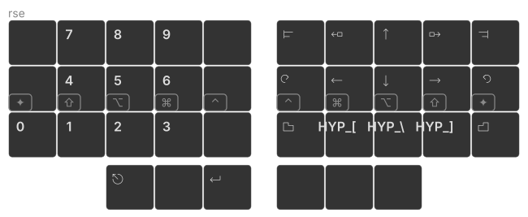
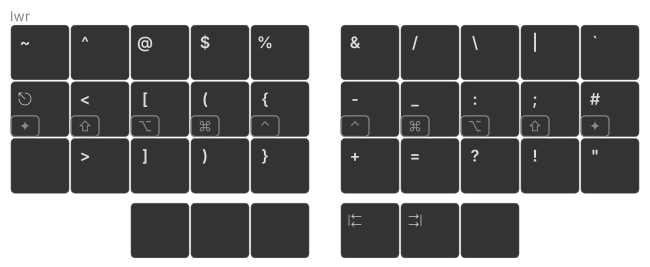
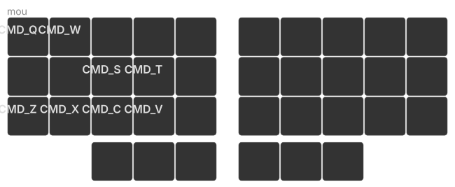

# Dubu36 Keyboard Layout

This repository contains my work-in-progress keyboard layout for 36 key keyboards.

The keyboard layout is specified in [`keymap.txt`](keymap.txt), and converted into ZMK and QMK
keymaps using the [`keymap_generator`](keymap_generator/) tool.

## Development

The keymap generator is a small Python package managed with
[uv](https://docs.astral.sh/uv/). Install uv, then from the repo root:

```sh
cd keymap_generator
uv sync --group diagrams
uv run generate-keymap zmk        # print the ZMK keymap
uv run generate-keymap qmk        # print the QMK keymap
uv run generate-keymap diagrams --out-dir ../diagrams
uv run pytest                     # run the test suite
uv run ruff check                 # lint
uv run ruff format                # format
uv run ty check                   # type check
```

The `diagrams` group provides cairosvg, which the renderer needs for PNG export
and `ty` needs to resolve the import.

The committed keymaps and diagrams are checked against `keymap.txt` by the test
suite, so regenerate all of them together after editing the layout. From the
repo root, with `uv` on `PATH`:

```sh
make generated
```

## Layout diagrams

`generate-keymap diagrams` writes a stacked reference card plus one board per
layer (except `hyp` and `adj`) to [`diagrams/`](diagrams/). Each key uses fixed
legend positions:

| Position | Content | Color |
| -------- | ------- | ----- |
| Top-left | Base (`default`) tap | Grey |
| Bottom-left | Hold binding | Grey by default; purple/orange if the hold itself switches to `lwr`/`rse` |
| Top-right | Symbols (`lwr`) | Purple |
| Bottom-right | Numbers / nav (`rse`) | Orange |

Hold box styling follows the keymap's hold-tap flavor:

| Flavor | Style |
| ------ | ----- |
| `tp` (tap-preferred, the default) | Outline box in the bottom-left quadrant |
| `hp` (hold-preferred) | Solid box in the bottom-left quadrant |
| one-shot (`LABEL/LABEL`) | Solid bar covering the full left half (top-left + bottom-left): one-shot on tap, momentary on hold |

Well-known taps (`TAB`, `RET`, `BKSP`, `ESC`, `SPC`, arrows, `HOME`/`END`, …)
render as icons instead of text. Pass `--no-png` to skip PNG export.

Combos (two-key chords) appear only on the stacked reference card: a small
rounded box sits on the seam between the two trigger keys and shows the
result, using the same glyphs as taps. Per-layer boards omit them.

### Reference


### default


### rse (nav + numbers)



### lwr (symbols)



### mou (left-hand shortcuts)



## Keymap

Each layer is a grid of the 36 keys, laid out the way they sit on the keyboard: three rows of ten
keys, then the six thumb keys. Every whitespace separated cell is one key:

```
layer default: homerow
  Q      W      F      P      G          J      L      U      Y      *
  A      R      S      T      D          H      N      E      I      O
  Z/adj  X      C      V      B          K      M      ,      .      '/adj
              ESC/mou:hp  _/shft  TAB/lwr:hp    RET  SPC/rse:hp  BKSP/hyp:hp
```

A cell is either a label, or a `TAP/HOLD` pair for keys that do something else when held, such as
`Z/adj` which types a `Z` when tapped and shifts to the adjust layer while held. `_` marks a key
that does nothing, and a `:FLAVOR` suffix chooses how a key tells a tap from a hold:

```
  T/cmd        tap-preferred, the default, which suits the home-row
  TAB/lwr:hp   hold-preferred, which the thumb keys use
  shft/shft    one-shot shift when tapped, a plain shift when held
  rse/rse      one-shot raise when tapped, a regular layer shift when held
```

Holds shared by several layers are written once as an `overlay`, which a layer picks up by listing
it after its name, as `homerow` is listed above. This is how the home-row modifiers are shared
between layers without repeating them; a cell can still define its own hold to override the
inherited one, or use `/_` to drop it.

The default layer is Colemak, with special characters remapped to prioritize commonly used
characters in day-to-day writing. Holding a key on the home-row gives the modifiers used in
shortcuts; the modifiers and layer shifts used in fluent writing sit on the thumbs instead, to
reduce issues with hold-tap timing. The remaining layers cover navigation and numbers, symbols,
window management, bluetooth, and left hand only shortcuts for when the right hand is on the mouse.

## Keyboards

I use this layout on these keyboards

### dubu36-travel

A wireless corne build with a custom designed case that folds up and sits on top of a standard 19mm
pitch laptop keyboard (e.g. a MacBook). It can easily be used on the go and does not slide around.


Specs:

- 3x5 [Corne Keyboard](https://github.com/foostan/crkbd) PCB
- [nice!nano](https://nicekeyboards.com/nice-nano/) MCU
- [Kailh Choc](https://mkultra.click/choc-switches) Brown switches
- [NuType F1](https://nuphy.com/collections/shop/products/nutype-f1-aw20-late-summer-night-ver-keycaps)
  Keycaps
- Custom printed [travel case](dubu36-travel/case)

### dubu36-ergo

A more ergonomic dactyl style version for the desk. Due to chip shortages, it is currently wired and
running QMK instead of wireless ZMK, until I can get my hands on more nice!nano MCUs.


Specs:

- Bastardkb's [Skeletyl](https://github.com/Bastardkb/Skeletyl) frame
- Some cheap Pro Micro MCU I had lying around
- Printed in
  [SpiderMaker Matte PLA](https://www.amazon.com/SPIDER-MAKER-Matte-Printer-Filament/dp/B07HWNK53C?th=1)
  (Iron Blue)
- Wired using Bastardkb's [flexible PCB](https://bastardkb.com/product/flexible-pcb/)
- Zeal [Zilent V2](https://zealpc.net/products/zilent?variant=5894832324646) switches
- [YMDK DSA Profile 9009](https://kbdfans.com/products/dsa-9009-keycaps-set) Keycaps
