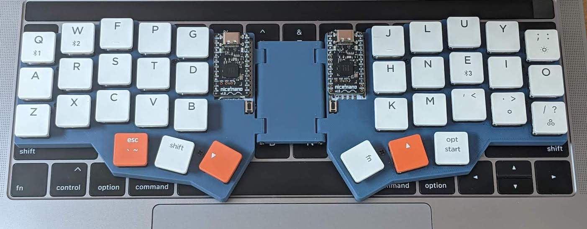
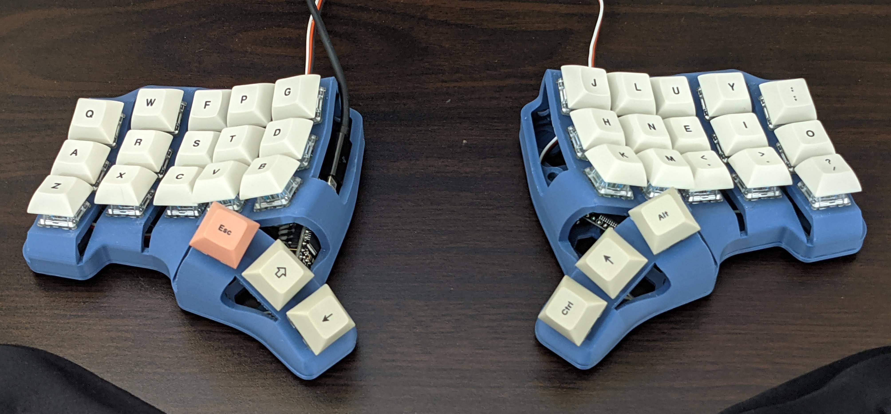

# Dubu36 Keyboard Layout

This repository contains my work-in-progress keyboard layout for 36 key keyboards.

The keyboard layout is specified in markdown below, and converted into ZMK and QMK
keymaps using the `generate_keymaps.py` script.

## Default Layer

The default layer is Colemak. With special characters remapped to prioritize
commonly used characters in day-to-day writing.

All modifier and layer change keys are on the thumb keys via hold-tap keys.
Hold to trigger the modifier, tap to generate the key listed in the row above.

|     |     |     |      |     |     |      |     |      |     |     |
| --- | --- | --- | ---- | --- | --- | ---- | --- | ---- | --- | --- |
| Q   | W   | F   | P    | G   |     | J    | L   | U    | Y   | \*  |
| A   | R   | S   | T    | D   |     | H    | N   | E    | I   | O   |
| Z   | X   | C   | V    | B   |     | K    | M   | ,    | .   | '   |
|     |     | ESC | SRCH | RET |     | TAB  | SPC | BKSP |     |     |
|     |     | cmd | shft | lwr |     | ctrl | rse | alt  |     |     |

## Raise Layer (Navigation + Numbers)

|     |     |     |        |         |     |       |        |         |        |       |
| --- | --- | --- | ------ | ------- | --- | ----- | ------ | ------- | ------ | ----- |
| ☐   | 7   | 8   | 9      | ☐       |     | HOME  | WORD_L | UP      | WORD_R | END   |
| ☐   | 4   | 5   | 6      | ☐       |     | FWD   | LEFT   | DOWN    | RIGHT  | BCK   |
| 0   | 1   | 2   | 3      | ☐       |     | SPC_L | TAB_L  | NXT_WIN | TAB_R  | SPC_R |
|     |     | ☐   | F_SRCH | CMD_RET |     | ☐     | ☐      | ☐       |        |       |
|     |     | ☐   | ☐      | ☐       |     | adj   | ☐      | ☐       |        |       |

## Lower Layer (Symbols)

|     |     |     |     |     |     |     |     |     |      |     |
| --- | --- | --- | --- | --- | --- | --- | --- | --- | ---- | --- |
| ~   | ^   | @   | $   | %   |     | &   | /   | \   | PIPE | `   |
| UML | <   | [   | (   | {   |     | -   | \_  | :   | ;    | #   |
|  ☐  | >   | ]   | )   | }   |     | +   | =   | ?   | !    | "   |
|     |     | ☐   | ☐   | ☐   |     | ☐   | ☐   | ☐   |      |     |
|     |     | ☐   | ☐   | ☐   |     | ☐   | adj | ☐   |      |     |

## Adjust Layer (Bluetooth)

|        |      |      |      |      |     |     |     |     |     |     |
| ------ | ---- | ---- | ---- | ---- | --- | --- | --- | --- | --- | --- |
| BT_CLR | BT_0 | BT_1 | BT_2 | BT_3 |     | ☐   | ☐   | ☐   | ☐   | ☐   |
| ☐      | ☐    | ☐    | ☐    | ☐    |     | ☐   | ☐   | ☐   | ☐   | ☐   |
| ☐      | ☐    | ☐    | ☐    | ☐    |     | ☐   | ☐   | ☐   | ☐   | ☐   |
|        |      | ☐    | ☐    | ☐    |     | ☐   | ☐   | ☐   |     |     |
|        |      | ☐    | ☐    | ☐    |     | ☐   | ☐   | ☐   |     |     |

## Keyboards

I use this layout on these keyboards

### dubu36-travel

A wireless corne build with a custom designed case that folds up and sits on top of a
standard 19mm pitch laptop keyboard (e.g. a MacBook). It can easily be used on the go
and does not slide around.

Specs:

- 3x5 [Corne Keyboard](https://github.com/foostan/crkbd) PCB
- [nice!nano](https://nicekeyboards.com/nice-nano/) MCU
- [Kailh Choc](https://mkultra.click/choc-switches) Brown switches
- [NuType F1](https://nuphy.com/collections/shop/products/nutype-f1-aw20-late-summer-night-ver-keycaps) Keycaps
- Custom printed [travel case](dubu36-travel/case)

### dubu36-ergo

A more ergonomic dactyl style version for the desk. Due to chip shortages, it is
currently wired and running QMK instead of wireless ZMK, until I can get my hands on more
nice!nano MCUs.

Specs:

- Bastardkb's [Skeletyl](https://github.com/Bastardkb/Skeletyl) frame
- Some cheap Pro Micro MCU I had lying around
- Printed in [SpiderMaker Matte PLA](https://www.amazon.com/SPIDER-MAKER-Matte-Printer-Filament/dp/B07HWNK53C?th=1) (Iron Blue)
- Wired using Bastardkb's [flexible PCB](https://bastardkb.com/product/flexible-pcb/)
- Zeal [Zilent V2](https://zealpc.net/products/zilent?variant=5894832324646) switches
- [YMDK DSA Profile 9009](https://kbdfans.com/products/dsa-9009-keycaps-set) Keycaps
